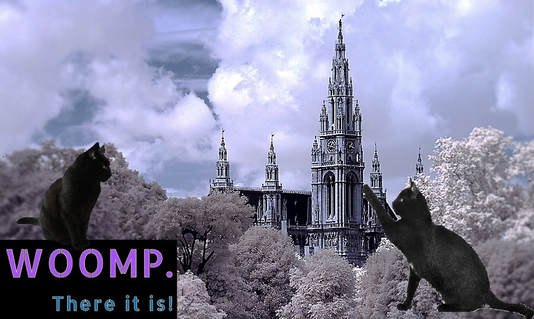

# Status
- We rigged the Masquerade's Question Lottery so we could talk to the Lords of Waterdeep
    - They did not know about the sanitation workers going missing & getting covered up
    - They did not yet have a plan to deal w/ the bad stuff in the sewers
    - We convinced them to pay is a 150g/day retainer (per person?) for the Dragoons to deal w/ the problem
    - So we should probably do that.

- Droop now has a Tuxedo of Cleanliness thanks to WOOMP

<small>Credit to Unknown Artist, this was something I found on pintrest and a reverse image search didn't turn up who made it.</small>

<small>Credit to [Cristiana Apostol](https://www.deviantart.com/cristianaapostol/art/Wizard-tower-193289959) for original image.</small>